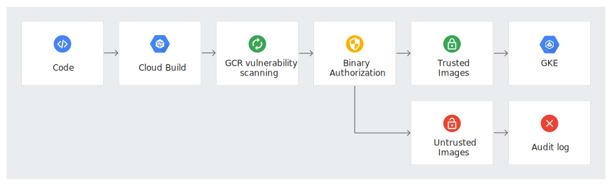
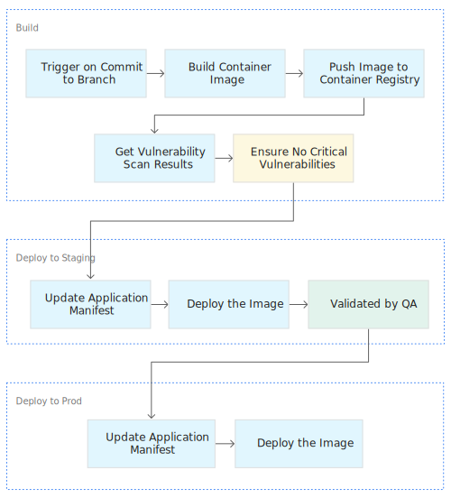

## Release story

We would like to release a new version of the software
from the existing development (Snapshot) version.

The versioning scheme is as follows.

### Semantic versioning

Semantic versioning is a formal convention for specifying compatibility. It uses a three-part version number: **major version**; **minor version**; and **patch**.  Version numbers  convey meaning about the underlying code and what has been modified. For example, versioning could be handled as follows:

| Code status  | Stage  | Rule  | Example version  |
|---|---|---|---|
| First release  | New product  | Start with 1.0.0  | 1.0.0  |
| Backward compatible fix  | Patch release  | Increment the third digit  | 1.0.1  |
| Backward compatible new feature  | Minor release  | Increment the middle digit and reset the last digit to zero  | 1.1.0  |
| Breaking updates | Major release | Increment the first digit and reset the middle and last digits to zero | 2.0.0 |


major.minor.patch as per semver.org

## Before you begin

Install the basic software and procure the required code
and dependencies, credentials.



All commands in this guide are run on a linux distribution

## Architecture of the release pipeline

An important part of the software development life cycle (SDLC)
is ensuring software release follow the ASF approved processes.

The flow of the process and artifact names generated in the
process.

The following diagram illustrates the release pipeline



The release pipeline consists of the following steps:
  1. Builds the artifacts (binary, zip files) with source code.
  2. Pushes the artifacts to staging repository
  3. Scans for the vulnerabilities. Voting process.

The QA team or the project community inspects the build files by 
downloading and testing. If it passes their requirements, they vote
appropriately in the mailing list. The release version metadata is
updated and the app is deployed to the public release.

## Setting up your environment

The release scripts use the following environment variables. you can
change these values to match your requirements, but all scripts assume
these environmental variables exist and contain a valid value.

1. Set the version name and tag

```sh
export VERSION="2.1.0"
export TAG=v$VERSION-rc1
```

2. Set the ASF credentials

```sh
export ASF_USERNAME="janardhan@apache.org"
export ASF_PASSWORD=""
```

## Creating builds

1. In the shell, build artifacts and deploy to staging

## Creating signing keys

Create md5 and sha512 signatures

## Nexus repo


```sh
curl "https://containeranalysis.googleapis.com/v1/projects/${PROJECT_ID}/notes/?noteId=qa-note" \
  --request "POST" \
  --header "Content-Type: application/json" \
  --header "Authorization: Bearer $(gcloud auth print-access-token)" \
  --header "X-Goog-User-Project: ${PROJECT_ID}" \
  --data-binary @- <<EOF
    {
      "name": "projects/${PROJECT_ID}/notes/qa-note",
      "attestation": {
        "hint": {
          "human_readable_name": "QA note"
        }
      }
    }
EOF
```


## Cleaning up


